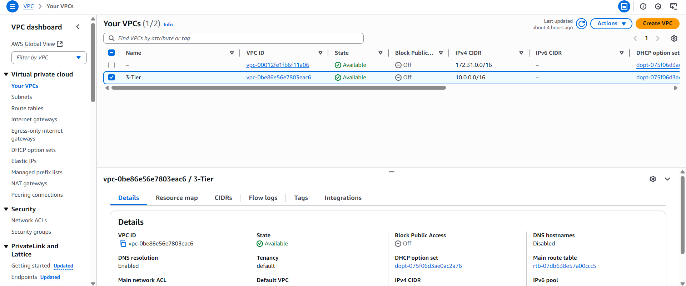
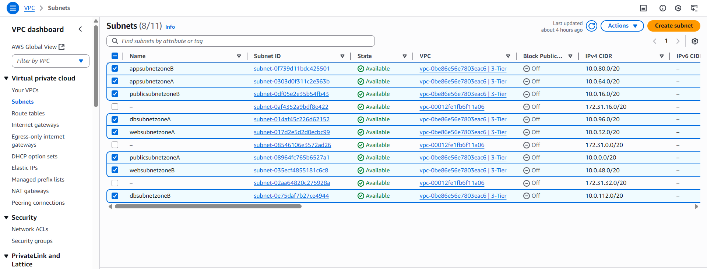
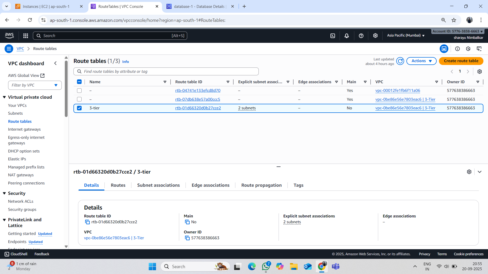
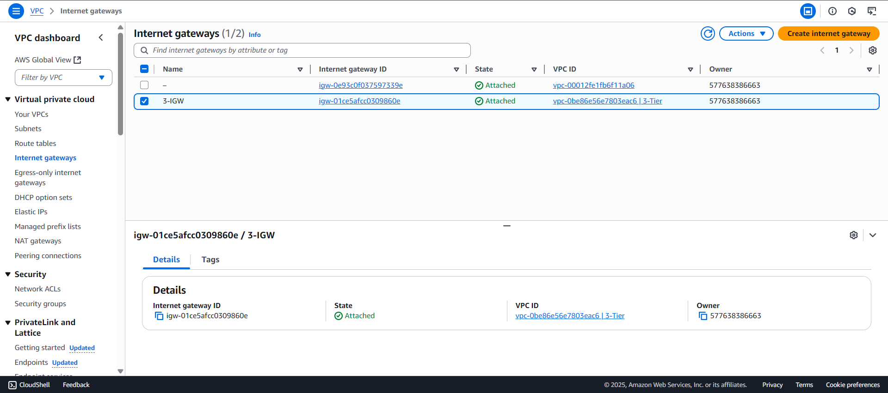
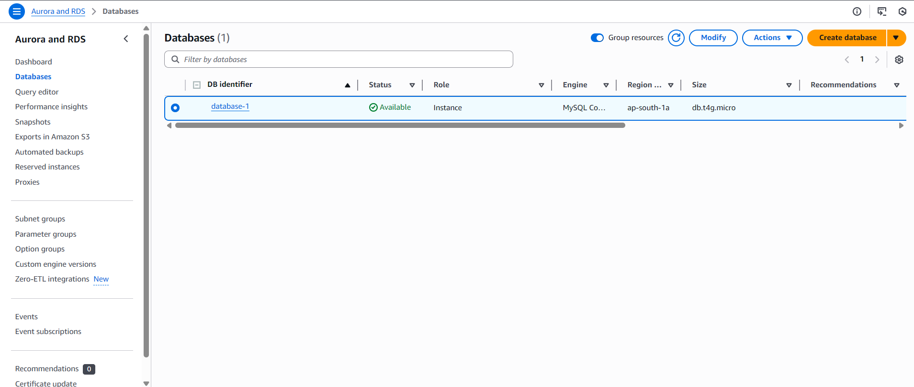
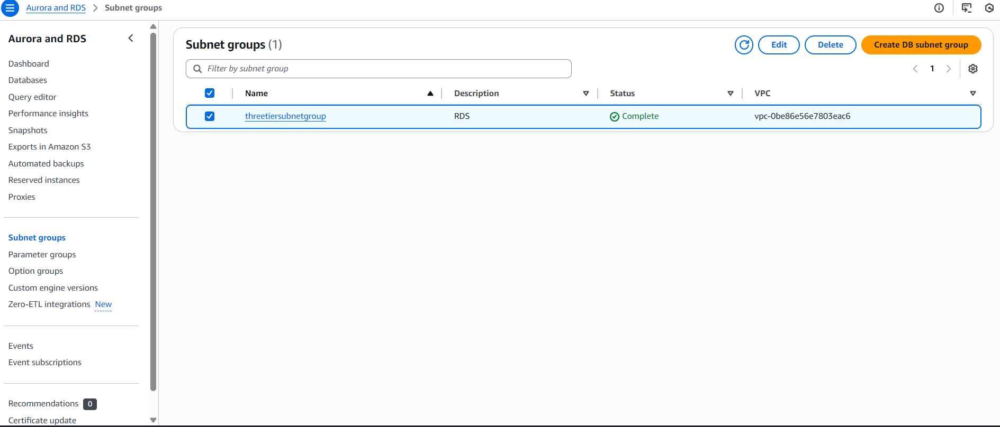
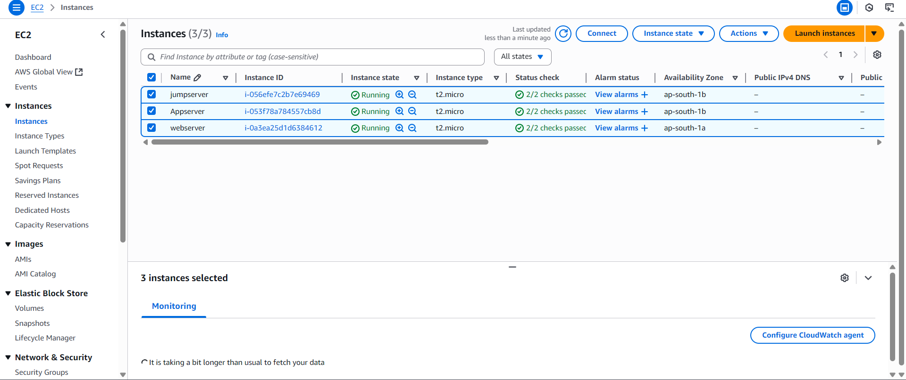

# Dynamic-Website-Deployment-on-AWS

## 📌 Introduction
This project demonstrates the deployment of a **dynamic web application** on **Amazon Web Services (AWS)** to enable real-time interaction between users and backend services.  
The solution leverages **EC2, RDS, And VPC** to ensure scalability, security, and availability.

---------------------------------------------------------------------------------------------------------------------------------------------------------------------------------------------------------------------
## 🚀 Architecture

            +------------------------+
            |       Users            |
            +----------+-------------+
                       |
                       v
            +------------------------+
            |   Load Balancer        |  <- Distributes traffic
            +----------+-------------+
                       |
        +--------------+--------------+
        |                             |
+----------------+             +----------------+
|   EC2 Instance |             |   EC2 Instance |
|   (Web Server) |             |   (Web Server) |
+-------+--------+             +--------+-------+
        |                             |
        +--------------+--------------+
                       |
               +----------------+
               |  Amazon RDS    |  <- Database
               +----------------+

- **Frontend & Application Layer**: Hosted on Amazon EC2 instances using **Nginx, PHP, and Node.js**.  
- **Database Layer**: Amazon RDS (MySQL) for structured data storage.  
- **Networking & Security**:
- VPC with **public and private subnets** for secure isolation.
- **Security Groups** to control inbound and outbound traffic.

## 🛠️ AWS Services Used
- **Amazon EC2** – to host the application stack.  
- **Amazon RDS (MySQL)** – for database operations.  
- **Amazon VPC** – for creating isolated and secure network architecture.   
- **Security Groups** – to control traffic between layers.

## ⚙️ Tech Stack
- **Frontend**: HTML, CSS
- **Backend**: Node.js, PHP, Nginx  
- **Database**: MySQL (Amazon RDS)  
- **Cloud**: AWS (EC2, RDS, VPC)

## 📂 Project Workflow
1.**VPC** with public and private subnets,Route table,.  
2. Launch **EC2 instances** in public subnet for hosting Nginx, PHP.  
3. Configure **Amazon RDS (MySQL)** in private subnet for database layer.  
4. Secure communication between layers using **Security Groups**.   
5. Deploy the dynamic website and test **real-time user interactions**.  

## 🔒 Security Considerations
- Used **VPC subnets** for isolation of application and database layers.    
- Enforced **Security Group rules** to restrict unwanted traffic.

## Step 1:

Create **vpc** :

Create **Subnet** :

Create **Route Table** :

Create **Internet Gateway**

## Step 2:

Create **Database**

Create **Subnet Group**

## Step 3:

Create 3 Server on AWS

1.Create Web-Server

2.Create App-Server

3.Create Jump-Server

## Step 4:

  
📈 Outcomes

-Hosting a full-stack dynamic application on AWS.

-Configuring secure and scalable infrastructure.

-Hands-on experience with EC2, RDS, VPC.

-Understanding real-time interaction between frontend and backend services.

